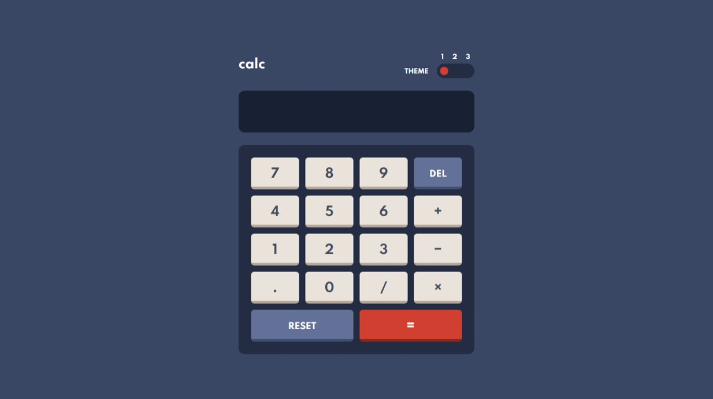

# Frontend Mentor - Calculator app

My solution to the [Calculator app challenge on Frontend Mentor](https://www.frontendmentor.io/challenges/calculator-app-9lteq5N29).

[Live site.](https://mubaraqwahab.github.io/frontendmentor/12-calculator-app-main/)

## The challenge

Users should be able to:

- See the size of the elements adjust based on their device's screen size
- Perform mathmatical operations like addition, subtraction, multiplication, and division
- Adjust the color theme based on their preference
- **Bonus**: Have their initial theme preference checked using `prefers-color-scheme` and have any additional changes saved in the browser

## My process

### Built with

- HTML
- Tailwind CSS
- TypeScript
- XState and [Stately Studio](http://stately.ai/)

The calculator turned out to be not so simple, due to the many (sometimes erroneous) input sequences it could receive (like when a user presses <kbd>2</kbd> <kbd>+</kbd> <kbd>/</kbd> <kbd>3</kbd> <kbd>.</kbd> <kbd>4</kbd> <kbd>.</kbd> <kbd>5</kbd>). I modelled the calculator as a state machine to handle these sequences conveniently and confidently. And I described this calculator machine in an article on my blog: ["Modelling a calculator as a state machine"](https://mubaraqwahab.github.io/blog/calculator/).

I also made the calculator operable by keyboard and (somewhat) screen-reader friendly. To do these, I

* marked up the calculator display with [the `<output>` element](https://developer.mozilla.org/en-US/docs/Web/HTML/Element/output), so that new items on the display are announced by screen readers
* marked
* using state machines
* making the calc accessible with `<output>`, aria `toolbar`, the roving tab index, `&minus;` and keyboard input

### What I learned

TODO: Write about these:

* accesskey and data-keyshortcuts
* scrolling display right
* `Number.isFinite` and overflow errors

### Continued development

TODO: Issues

* Whenever the display changes, NVDA announces all the display content. Is this a problem?
* When the display ends with a number like `2.`, NVDA reads "two" and ignores the point.
* Exposing keyboard shortcuts to screen readers. NVDA reads aria-keyshortcuts after the accessible name without specifying it's a shortcut.
* Decimal arithmetic (instead of floating point)

### Resources

- [Example resource 1](https://www.example.com) - This helped me for XYZ reason. I really liked this pattern and will use it going forward.
- [Example resource 2](https://www.example.com) - This is an amazing article which helped me finally understand XYZ. I'd recommend it to anyone still learning this concept.

* Aria toolbar
* Roving tab index
* Aria keyshortcuts
* Accesskey
