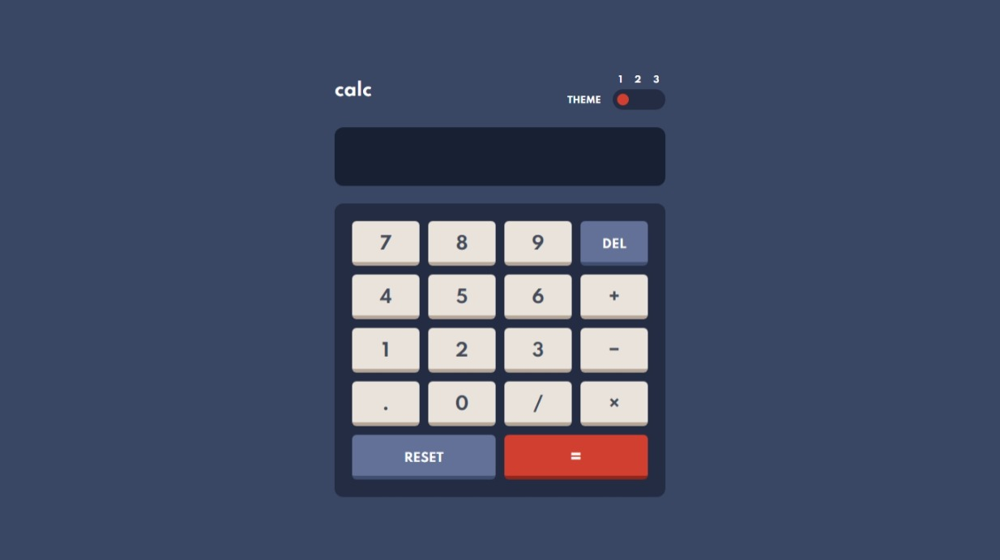

# Frontend Mentor - Calculator app

My solution to the [Calculator app challenge on Frontend Mentor](https://www.frontendmentor.io/challenges/calculator-app-9lteq5N29).

[Live site.](https://mubaraqwahab.github.io/frontendmentor/12-calculator-app-main/)

## The challenge

Users should be able to:

- See the size of the elements adjust based on their device's screen size
- Perform mathmatical operations like addition, subtraction, multiplication, and division
- Adjust the color theme based on their preference
- **Bonus**: Have their initial theme preference checked using `prefers-color-scheme` and have any additional changes saved in the browser

## My process

### Built with

- HTML
- Tailwind CSS
- TypeScript
- XState and [Stately Studio](http://stately.ai/)

The calculator turned out to be a bit complex, due to the many (sometimes erroneous) input sequences it could receive (like when a user presses <kbd>2</kbd> <kbd>+</kbd> <kbd>/</kbd> <kbd>3</kbd> <kbd>.</kbd> <kbd>4</kbd> <kbd>.</kbd> <kbd>5</kbd>). I modelled the calculator as a state machine to handle these sequences conveniently and confidently. And I described this calculator machine in detail in an article on my blog: ["Modelling a calculator as a state machine"](https://mubaraqwahab.github.io/blog/calculator/).

I also made the calculator operable by keyboard and (somewhat) screen-reader friendly. To achieve these, I

* marked up the calculator display with [the `<output>` element](https://developer.mozilla.org/en-US/docs/Web/HTML/Element/output), so that new items on the display are announced by screen readers
* used the Unicode characters `×` (`&times;`) and `−` (`&minus;`) on the UI, instead of their ASCII alternatives (`*` and `-`), so that screen readers (NVDA at least) read them correctly as "times" and "minus".
* implemented the button grid as an [ARIA toolbar](https://www.w3.org/WAI/ARIA/apg/patterns/toolbar/), so a user can navigate between the buttons with the left and right arrow keys on their keyboard.
* added keyboard shortcuts for the buttons, so a user can type on their keyboard <kbd>1</kbd> <kbd>+</kbd> <kbd>2</kbd> <kbd>.</kbd> <kbd>3</kbd> <kbd>=</kbd>, for example, to evaluate the expression `1 + 2.3`, instead of clicking the buttons on the UI.

### What I learned

* HTML has a global [`accesskey` attribute](https://developer.mozilla.org/en-US/docs/Web/HTML/Global_attributes/accesskey) that's supposed to be used on an element to specify the keyboard shortcut that activates that element. However, due to issues with it (browser support, accessibility, and ergonomics), I didn't use it to specify the keyboard shortcuts I mentioned above.

* HTML (via ARIA) also has an an [`aria-keyshortcuts` attribute](https://w3c.github.io/aria/#aria-keyshortcuts) for exposing keyboard shortcuts to assistive technologies (like screen readers). I also didn't use this, because the NVDA output was repetitive: NVDA would read a `<button aria-keyshortcuts="2">2</button>`, for example, as "two two" (one "two" for the button text and another for the `aria-keyshortcuts`). In the end, I didn't use any special mark up to indicate the presence of keyboard shortcuts (and admittedly that may be suboptimal).

* JavaScript doesn't have a native way (or at least an intuitive way) to distinguish between an overflow error and a division-by-zero error in a calculation. That is `x / 0 === Number.MAX_VALUE * y === Infinity`, for any `x > 0` and `y > 1`. (An interesting tangent is that `0 / 0 === NaN`.)

### Continued development

* Whenever the display changes, NVDA announces the entire display content and not just the newly added/removed item. Is this a problem? On on hand, the announced output is (very) verbose; on the other, announcing just the changes would give little context to the changes.
* When the display ends with a number like `2.`, NVDA reads "two" and ignores the point.
* The calculator currently uses floating point arithmetic and, as a result, can't correctly solve some expressions (like `0.1 + 0.2`). Using a decimal number library (there are several on npm) should fix this.
